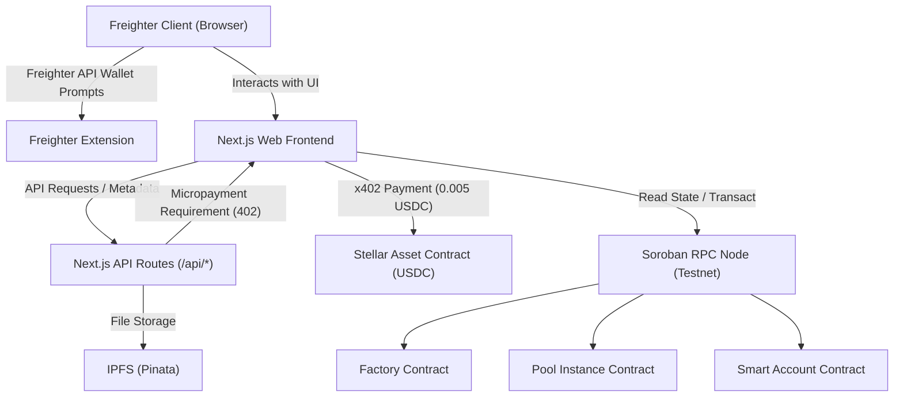
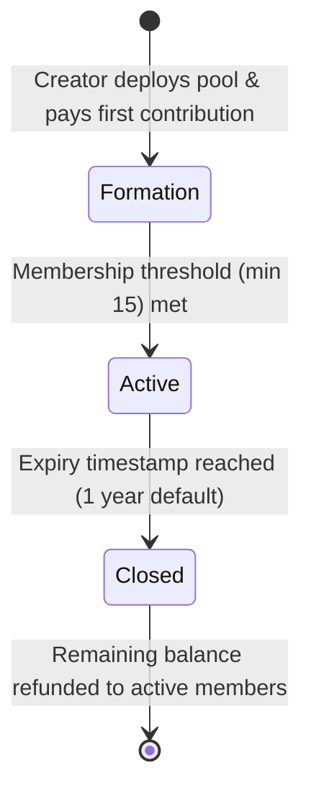
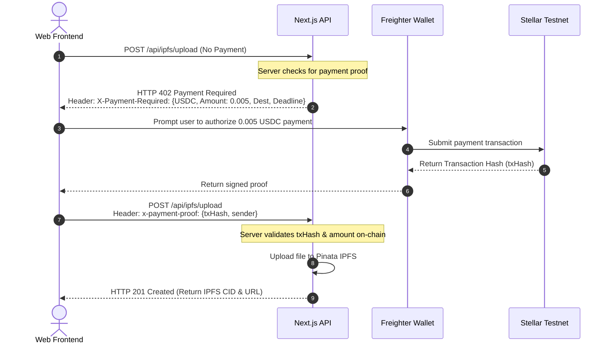

# NexusGuard: Decentralized Peer-to-Peer Microinsurance Protocol

NexusGuard is a decentralized peer-to-peer (P2P) microinsurance protocol built on the **Stellar Network** utilizing **Soroban Smart Contracts (v22)**. It allows communities to form self-governed risk-protection pools, pay automated recurring contributions in USDC, submit claims pinned to IPFS, and vote collectively on payouts.

---

## 1. Executive Summary & Problem Space

Formal insurance in emerging economies (such as Nigeria) is often expensive, opaque, and out of reach for a majority of the population. The traditional insurance model suffers from:
*   **High Premium Costs**: High administrative overhead makes micro-policies unprofitable for traditional insurers.
*   **Delayed Payouts**: Lengthy claim assessments can take weeks or months.
*   **Erosion of Trust**: Historic instances of arbitrarily denied payouts have led to deep-seated skepticism toward formal institutions.

### The NexusGuard Solution
NexusGuard bypasses traditional intermediaries by replacing them with decentralized P2P pools:
1.  **Community Pools**: Members pool funds to insure specific everyday risks (e.g., cracked screens, medical incidents, agricultural losses).
2.  **Autonomous Governance**: Claims are reviewed and voted on by a rotating subset of pool members, ensuring democratic and trustless decision-making.
3.  **Automated Execution**: Contributions are collected automatically via Freighter-approved smart accounts. Approved claims trigger instant, code-enforced USDC payouts.

---

## 2. High-Level Architecture

NexusGuard integrates decentralized UI, browser wallet extensions, Next.js serverless API routes, IPFS storage, and Soroban smart contracts.



### Key Components
*   **Web Client**: React/Next.js SPA using TypeScript and TailwindCSS.
*   **Stellar Freighter Wallet**: Connects user accounts, requests access, and signs on-chain transactions.
*   **Next.js API Routes**: Standard API endpoints acting as a serverless backend. Handles notifications, statistics, validation, and gates access to IPFS pinning.
*   **IPFS (Pinata)**: Distributed storage layer for claim evidence (PDFs, receipts, images). Files are pinned using the `x402` micropayment mechanism to avoid service abuse.
*   **Stellar/Soroban Ledger**: Host ledger for all on-chain transactions, state storage, and logic execution.

---

## 3. Smart Contracts (Soroban v22)

The on-chain system consists of three main contracts written in Rust using the Soroban SDK v22.

### 3.1. Factory Contract (`nexusguard-factory`)
The Factory contract is responsible for deploying, tracking, and upgrading individual pool instances. Deployed at: `CAWXDSZM52E5BW7G6TFX7DTXSHF7F75TUSSWW7B442NBEU3CADXNVTXH`

#### Key Functions:
*   `initialize(admin: Address, pool_wasm_hash: BytesN<32>, token_address: Address)`: Registers the factory administrator, pool source WASM hash, and token contract address.
*   `create_pool(...) -> Address`: Deploys a new pool instance deterministically using a salt derived from the current pool index. Initializes the pool with custom configuration parameters.
*   `pause_pool(caller: Address, pool_address: Address)`: Disables pool functions. Can be called by the Factory admin or the pool creator.
*   `unpause_pool(admin: Address, pool_address: Address)`: Re-enables a paused pool. Only Factory admin.
*   `update_pool_wasm(admin: Address, new_wasm_hash: BytesN<32>)`: Upgrades the pool bytecode used for future deployments.
*   `get_all_pools() -> Vec<PoolRecord>`: Returns registry details of all created pools.

---

### 3.2. Pool Contract (`nexusguard-pool`)
The Pool contract manages member enrollment, recurring monthly contributions, claim submission, peer voting, signer rotation, and treasury payouts.

#### Pool Categories
```rust
pub enum PoolCategory {
    Health,     // 0
    Crop,       // 1
    Property,   // 2
    Vehicle,    // 3
    Travel,     // 4
    Business,   // 5
    Other,      // 6+
}
```

#### Pool Lifecycle Phases


1.  **Formation Phase**: Users join the pool by paying the initial fixed contribution. Funds are locked in the contract treasury. Claims cannot be filed.
2.  **Active Phase**: Triggered automatically when the member cap is reached. A randomly selected group of signers (30% of members) is assigned to review claims.
3.  **Closed Phase**: Triggered after the pool lifecycle expires. The contract automatically liquidates and distributes remaining funds equally to all active members.

#### Core Rules & Governance Mechanisms:
*   **Signer-Based Voting**: Rather than requiring all members to vote on every claim, the contract randomly selects **30% of active members** as reviewers. A **60% quorum** of these signers is required to resolve a claim (approve or reject).
*   **Signer Rotation**: Signers are rotated every **60 days** using a pseudo-random selection process to prevent collusion.
*   **Waiting Period**: Claims can only be filed **60 days** after a pool transitions to the `Active` phase.
*   **Contribution Grace Period**: Members must pay monthly contributions by the 8th of each month. Missed contributions trigger a **7-day grace period**. If unpaid, the pool creator or manager can call `remove_defaulter` to strip the user of active status.
*   **Payout Limits**:
    *   *Single Payout Cap*: A single claim payout cannot exceed **10% of the total treasury balance**.
    *   *Monthly Payout Cap*: Total payouts in a single monthly cycle cannot exceed **25% of the total treasury balance**.
    *   *Claim Limit*: A member can only have **one successful claim payout** per monthly cycle.

---

### 3.3. Smart Account Contract (`poolsafe-smart-account`)
Provides programmable key management, automated transactions, and multisig protection. Deployed at: `CCERWUE35WN7M4PN6XYK7CDCJZX35TC53TFATJNBRA6I3FDS3RVS65YF`

#### Key Features:
*   **Auto-Pay (Recurring Payments)**: Enables hands-free monthly pool contributions. The user signs a single USDC spending allowance. The Next.js API routes or a cron script can call `execute_recurring(payment_id)` to extract the monthly USDC contribution from the user's wallet without prompting Freighter.
*   **Spending Limits**: Restricts the maximum amount of tokens a user's account can spend in a specific timeframe (e.g., maximum 50 USDC per day).
*   **Multisig Protection**: Gates high-value transactions behind multi-signature approval. Requires a user-specified threshold (e.g., 2-of-3) of signer approvals to execute a proposed transfer.
*   **Scheduled Transfers**: Executes a token transfer automatically after a specified Unix timestamp has elapsed.

---

## 4. x402 Micropayment Protocol Gating

To prevent spam and cover hosting costs, the backend API endpoints (such as `/api/ipfs/upload`) are gated behind Coinbase's **x402 Micropayment Protocol** adapted for Stellar. 

### Gating Sequence Diagram



> [!NOTE]
> The server verifies the transaction on-chain via Soroban RPC, checking that the sender, receiver, asset type, and amount correspond to the expected gating parameters, preventing double-spending and unauthorized access.

---

## 5. API Route Specification

The web application runs entirely serverless using Next.js API routes.

| Endpoint | Method | Gated By | Description |
| :--- | :--- | :--- | :--- |
| `/api/health` | GET | None | Performs basic system health checks. |
| `/api/pools` | GET | None | Retrieves all registered pool structures from the Factory. |
| `/api/pools/stats` | GET | None | Computes aggregate statistics (total volume, active members, pools). |
| `/api/ipfs/upload` | POST | **x402** | Uploads raw claim evidence (images/PDFs) to Pinata. Gated by a `0.005 USDC` fee. |
| `/api/ipfs/upload-json` | POST | **x402** | Uploads metadata JSON mapping claim details to Pinata. Gated by `0.005 USDC`. |
| `/api/ipfs/pin/[cid]` | GET | None | Inquires status of pinned IPFS content. |
| `/api/claims/precheck` | POST | None | Evaluates a user claim against pool limits before submitting on-chain. |
| `/api/notifications` | GET | None | Fetches internal activity alerts/notifications for a specific address. |
| `/api/notifications/read-all` | PATCH | None | Marks all notifications as read. |
| `/api/notifications/[id]` | PATCH | None | Marks a single notification as read. |
| `/api/notifications/[id]` | DELETE | None | Deletes a single notification. |

---

## 6. Frontend Configuration

The React frontend utilizes **TypeScript** and **TailwindCSS** for styles and views:

*   **Wallet Integration**: Leverages `@stellar/freighter-api` to interact with Freighter. The `WalletContext` stores the user's active address and handles connection events.
*   **Routing**: Standard pages mapping to paths:
    *   `/explore-pools`: View and filter active, formation, and closed pools.
    *   `/create-pool`: Form interface to deploy pools via the Factory.
    *   `/pool-details`: Manage a pool instance, view claims, pay contributions, and invite members.
    *   `/claim-voting`: Specialized interface displaying open claims that require voting by signers.
    *   `/dashboard`: User profile displaying smart account limits, registered pools, and notifications.
    *   `/guidelines`: Documentation describing user rights, contribution requirements, and system governance.

---

## 7. Developer & Deployment Guide

### Environment Variables
Configure environment variables to connect the frontend to the deployed Soroban contracts.

#### Frontend (`frontend/.env.local`):
```env
NEXT_PUBLIC_FACTORY_CONTRACT_ID=CAWXDSZM52E5BW7G6TFX7DTXSHF7F75TUSSWW7B442NBEU3CADXNVTXH
NEXT_PUBLIC_USDC_TOKEN_ID=CBIELTK6YBZJU5UP2WWQEUCYKLPU6AUNZ2BQ4WWFEIE3USCIHMXQDAMA
NEXT_PUBLIC_DEPLOYER_ADDRESS=GALK2FN3QXLETSVMUEVWR4IE2FYEFEMWZR2QXU5EU6APVJVATFLS7HON
NEXT_PUBLIC_SMART_ACCOUNT_CONTRACT_ID=CCERWUE35WN7M4PN6XYK7CDCJZX35TC53TFATJNBRA6I3FDS3RVS65YF
PINATA_API_KEY=your_pinata_api_key
PINATA_SECRET_API_KEY=your_pinata_secret_api_key
X402_RECEIVER_ADDRESS=GALK2FN3QXLETSVMUEVWR4IE2FYEFEMWZR2QXU5EU6APVJVATFLS7HON
```

#### Contracts (`contracts/.env`):
```env
STELLAR_SOURCE_ACCOUNT=nexusguard-deployer
FACTORY_ADMIN=GALK2FN3QXLETSVMUEVWR4IE2FYEFEMWZR2QXU5EU6APVJVATFLS7HON
POOL_TOKEN_ADDRESS=CBIELTK6YBZJU5UP2WWQEUCYKLPU6AUNZ2BQ4WWFEIE3USCIHMXQDAMA
```

### Deployment Flow
The script `contracts/scripts/deploy-pool-testnet.sh` automates compiling and deploying the contract suite:

```bash
cd contracts
bash scripts/deploy-pool-testnet.sh
```

#### Steps Executed by Deploy Script:
1.  **Build WASM Code**: Compiles the Rust smart contracts (`nexusguard-factory`, `nexusguard-pool`, `poolsafe-smart-account`) using target `wasm32v1-none`.
2.  **Upload WASM**: Uploads the compiled `.wasm` binaries to Stellar Testnet and returns their WASM bytecode hashes.
3.  **Instantiate Factory**: Deploys the Factory contract using its WASM hash.
4.  **Initialize Factory**: Calls the `initialize` function on the Factory, passing the administrator's address, the Pool contract WASM hash, and the USDC Stellar Asset Contract address.
5.  **Write Settings**: Automatically exports contract addresses to the `.env` and `.env.local` configuration files.

---

> [!WARNING]
> Ensure your Freighter wallet is set to **Testnet** and has been funded with test XLM from the Friendbot before submitting transactions.
