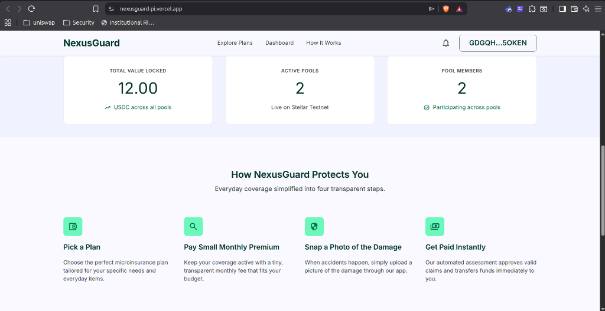

# NexusGuard
A decentralized peer-to-peer microinsurance protocol built on Stellar.

NexusGuard enables communities to create transparent, self-governed protection pools for everyday risks. By utilizing Soroban smart contracts, on-chain voting, automated USDC contributions, and programmable smart accounts, it replaces expensive and opaque traditional insurance models with a trustless, P2P alternative.

It's the Skyscanner equivalent for community-driven microinsurance risk-sharing.

**Live Demo:** [nexusguard-pi.vercel.app](https://nexusguard-pi.vercel.app)

---

## Screenshots

### Landing Page & Live Statistics

---

## Motivation
Traditional insurance in emerging markets is expensive, slow, and heavily centralized, which often erodes trust entirely. When people face everyday shocks—a cracked phone screen, a medical bill, or a stolen laptop—they are left with no financial fallback.

NexusGuard makes risk protection legible and accessible:
*   **Form a Pool**: Set a contribution size, member cap, and risk category.
*   **Participate Democratically**: A randomly selected 30% of members serve as signers to review and vote on claims with a 60% quorum.
*   **Pay Automatically**: Leverage Soroban smart accounts for hands-free monthly auto-pay, while the x402 protocol gates off-chain resources (like IPFS uploads) with micro-fees.

---

## Features
*   **Cover Pools** — Create pools for Health, Crop, Property, Vehicle, Travel, Business, or other risk types.
*   **Smart Account Auto-Pay** — One-time Freighter approval allows smart accounts to execute recurring monthly USDC contributions automatically.
*   **IPFS Evidence Verification** — Claim evidence (photos, receipts) is securely pinned to IPFS via Pinata.
*   **x402 Micropayment Gating** — API routes for file uploading are gated by a one-time micropayment (0.005 USDC) to prevent spam without user accounts.
*   **On-chain Governance** — 30% random member assignment for signer voting with automatic payouts on approved claims.
*   **Treasury Payout Caps** — Built-in guardrails (max 10% per claim, max 25% monthly) protect the pool's solvency.
*   **Signer Rotation** — Reviewers are rotated every 60 days via on-chain pseudo-random selection.

---

## Stack
*   **Frontend**: Next.js 14, TypeScript, TailwindCSS
*   **Wallet**: Freighter + `@stellar/freighter-api`
*   **Smart Contracts**: Rust, Soroban SDK v22
*   **Backend APIs**: Next.js Serverless API routes
*   **Storage**: IPFS via Pinata API

---

## Running it locally

### Prerequisites
*   **Node.js** ≥ 20.0.0
*   **Rust** (latest stable) + `wasm32-unknown-unknown` target
*   **Stellar CLI** — `cargo install stellar-cli`
*   **Freighter Wallet** browser extension

### 1. Setup Frontend
```bash
cd frontend
npm install
```

Configure `frontend/.env.local`:
```env
NEXT_PUBLIC_FACTORY_CONTRACT_ID=CAWXDSZM52E5BW7G6TFX7DTXSHF7F75TUSSWW7B442NBEU3CADXNVTXH
NEXT_PUBLIC_USDC_TOKEN_ID=CBIELTK6YBZJU5UP2WWQEUCYKLPU6AUNZ2BQ4WWFEIE3USCIHMXQDAMA
NEXT_PUBLIC_DEPLOYER_ADDRESS=GALK2FN3QXLETSVMUEVWR4IE2FYEFEMWZR2QXU5EU6APVJVATFLS7HON
NEXT_PUBLIC_SMART_ACCOUNT_CONTRACT_ID=CCERWUE35WN7M4PN6XYK7CDCJZX35TC53TFATJNBRA6I3FDS3RVS65YF
PINATA_API_KEY=your_pinata_api_key
PINATA_SECRET_API_KEY=your_pinata_secret
X402_RECEIVER_ADDRESS=GALK2FN3QXLETSVMUEVWR4IE2FYEFEMWZR2QXU5EU6APVJVATFLS7HON
```

Run the dev server:
```bash
npm run dev
```

### 2. Setup Contracts (Optional)
To build and redeploy the smart contracts:
```bash
cd contracts
cargo build --target wasm32-unknown-unknown --release
# Deploy to Testnet
bash scripts/deploy-pool-testnet.sh
```

---

## How P2P Microinsurance works
NexusGuard coordinates risk coverage completely on-chain through three phases:
*   **Formation**: The creator initializes a pool and pays the first contribution. Members join by paying a fixed contribution until a minimum threshold (15) is met.
*   **Active**: Once active, a 60-day waiting period is enforced before claims can be submitted. Members pay their USDC contributions monthly (by the 8th of each month). If a contribution is missed, a 7-day grace period is granted before they can be removed.
*   **Closed**: After the pool's duration (typically 1 year), the pool creator liquidates the contract, splitting the remaining treasury balance equally among all active, non-defaulting members.

---

## Roadmap
*   **Dynamic Payout Adjustments**: Automatically adjust contribution sizes or payout caps based on historical claim frequency.
*   **Automated Grace Period Removals**: Trigger defaulter removals automatically via cron jobs calling the smart account's scheduled transfers.
*   **Soroban AMM Liquidity Farming**: Earn yield on pool reserves by routing idle USDC treasury balances into Soroban AMM pools (e.g. Soroswap) to grow the cover pool's overall depth.
*   **DAO Governance Upgrades**: Enable member proposals to change contract-level parameters (e.g. default 60-day waiting period or signer percentage) via voting.

---

## Documentation
*   **[Technical Documentation](docs/documentation.md)**: Architecture, data flow, component breakdown, and how everything fits together.
*   **[Contributing Guide](docs/CONTRIBUTING.md)**: How to set up locally, branch conventions, PR guidelines, and ways to contribute.

---

## License
MIT
